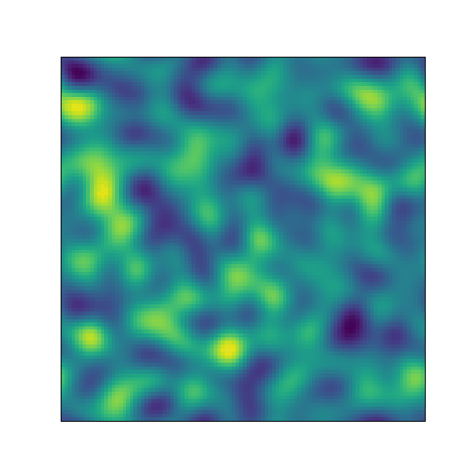

# AI-Driven Parameter Estimation for Cahn-Hilliard Simulations

This project tackles the challenging scientific inverse problem of estimating Cahn-Hilliard (CH) equation coefficients directly from simulation video data. I developed an end-to-end pipeline, starting with a custom PDE solver to generate a unique dataset of 5,000 simulation sequences. A ConvRNN model was then trained in PyTorch to analyze these sequences, successfully learning the relationship between the simulation's visual evolution and its underlying physical parameters.

### Tech Stack
`Python` | `PyTorch` | `NumPy` | `SciPy` | `Jupyter Notebook` | `Git`

---

### Key Features

*   **Custom Data Generation:** Engineered a PDE solver from scratch in Python to generate a dataset of 5,000 unique simulations (comprising over 50,000 distinct frames). The solver utilizes a Fast Fourier Transform (FFT) spectral method for spatial derivatives and a semi-implicit finite difference scheme for time-stepping.

*   **Advanced Sequential Modeling:** Designed and trained a ConvRNN (Convolutional Recurrent Neural Network) to analyze the spatio-temporal dynamics of the simulations. This approach successfully overcame the information insufficiency of single-frame models by learning from the simulation's evolution over time.

*   **End-to-End Workflow Optimization:** Implemented a robust and efficient training pipeline featuring Automatic Mixed Precision (AMP) for faster training, a `ReduceLROnPlateau` learning rate scheduler, and early stopping to prevent overfitting.

*   **Quantified Model Performance:** The final model achieved a Mean Squared Error of ~3.6 on the validation set for coefficients in the range of [1, 10]. This result establishes a strong proof-of-concept and a baseline for future work.

---

### Project Structure

For a complete walkthrough of the code and process, please see the primary notebook:

*   **[`Master_Project_Notebook.ipynb`](./Master_Project_Notebook.ipynb)**: Contains the full end-to-end workflow, including data generation, preprocessing, model definition, training, and evaluation.
